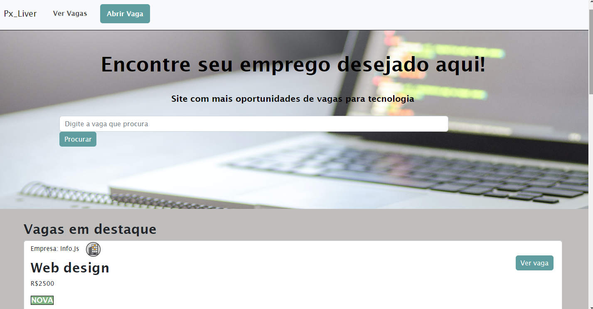

<h1>Api de Vagas de Empregos</h1>

<br>

<a href="https://shy-moon-6673.fly.dev/">Link do Projeto 🔗</a><br>

<h2>Resumo do Projeto 🧾<h2>
<p>Este projeto descreve uma simulação de API de vagas. A API permite que os usuários se registrem como empregadores, criem um perfil, publiquem  para os canditatos verem a vagas disponivéis de emprego e se candidatem a vagas em aberto.(obs:Vagas fictícias)</p><br>


<h2>Como Usar 💻<h2>
<ul>
    <li>O empregador deve ir em no botão "Abrir vaga"</li>
    <li>Colocar os dados da vaga que ele quer anunicar</li>
    <li>Ao finalizar ele pode apertar no botão "Cadastrar Vaga"</li>
    <li>Para ver a vaga anunciada ele pode apertar no botão "Ver Vaga"</li>
    <li>Por fim para pesquisar as vagas pode apertar na barra de pesquisa acima e digitar a vaga o nome que procura</li>

    

</ul> <br>

  


<h2>Tools ⚒️<h2>
 
<br>
 
 
<br>

<h2>EndPoints 🗔</h2>
<h4>Parâmetros
<ul>
    <li>Título (obrigatório): título da vaga.</li>
    <li>Salário (obrigatório): salário do cargo.</li>
    <li>Nome da Empresa (obrigatório).
    <li>Email (obrigatório):Email para contato.</li>
</ul>
<p>MÉTODO USADO DA API</p>
 <a href="#">Método: Post</a><br>
 <a href="#">Método: Get</a>

<h2>FUNCIONALIDADES ⚙️</h2>
<ul>
    <li>Dependencias do projeto "Express"</li>
    <li>Pasta rotas define a rota da página "Cadastrar rotas"</li>
    <li>No arquivo "app" chama todas as dependecias necessária como o bodyParser,Sequelize, o banco de dados "SQLite" , express-handlebars, método "Path" (caminho), por fim o método "domain", que permite a criação de domínios de campos que podem ser aplicados a campos das tabelas, restringindo o conjunto de valores aceitos para inclusão e/ou alteração dos dados.
    <li>Na pasta "Views" contém a pasta "Layout" que tem o arquivo "main.handlebars" onde a função dele é onde está os links para as rotas da página principal e para página de cadastrar vagas</li>
    <li>O arquivo "add.handlebars" é onde contém o contéudo de cadastramento de vagas, nele está o formulário</li>
    <li>No arquivo "view.handlebars" está as informações da vagas que é buscada no banco de dados ao adicionar os requerimentos pedido</li>
    <li>Por fim o "index.handlebars" é onde está a página principal</li>
</ul>

<h2>Links para rodar esse projeto 🔗</h2>

````bash
# Clonar projeto
$ gh repo clone Alexsandro08/API_Vagas_De_Emprego

#Entrar no diretorio
$ cd Projeto-site-de-vagas

#Instalar dependências
$ npm install

````

<h2>CONCLUSÃO FINAL 📝</h2>
<p>O projeto foi criado para demonstrar a habilidade de criação para projetos reais, com diversas funcionalidades adicionada para a aplicação ficar satisfátoria para o usuário integarir.</p>
